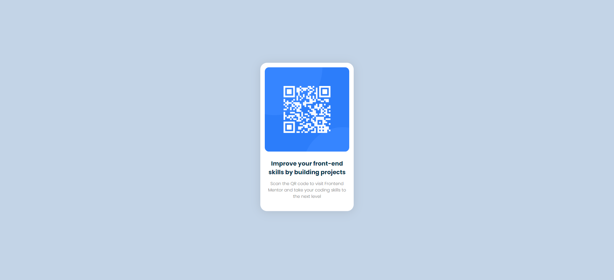

# Frontend Mentor - QR code component solution

This is a solution to the [QR code component challenge on Frontend Mentor](https://www.frontendmentor.io/challenges/qr-code-component-iux_sIO_H). Frontend Mentor challenges help you improve your coding skills by building realistic projects. 

## Table of contents

- [Overview](#overview)
  - [Screenshot](#screenshot)
- [My process](#my-process)
  - [Built with](#built-with)
  - [Continued development](#continued-development)
  - [Useful resources](#useful-resources)

## Overview

This is a challenge where I have to provide a QR code which leads to Frontend Mentor with a little description about the link. It's been done using HTML & CSS.

### Screenshot

 

## My process 

I tried to notice every little detail in the given design and made some notes like font family, size, etc. I went step by step, beginning with making divs. After creating a basic layout of all parts, I focused on making it similar to the design. As I fixed the size of the div, I moved to the image and then the text. At last, I moved the div to the middle and added shadows.

### Built with

- Semantic HTML5 markup
- CSS custom properties
- Flexbox
- Google fonts

### Continued development

Placing a div in the middle is something I still struggle with, so I'd like to practice more!

### Useful resources

- [Stack Overflow](https://www.stackoverflow.com) - This helped me for various little problemts. I really liked this pattern and will use it going forward.
- [W3Schools](https://www.w3schools.com) - This is an amazing site which helped me with little features of HTML and CSS. I'd recommend it to anyone regardless of their level as they're very organized.
